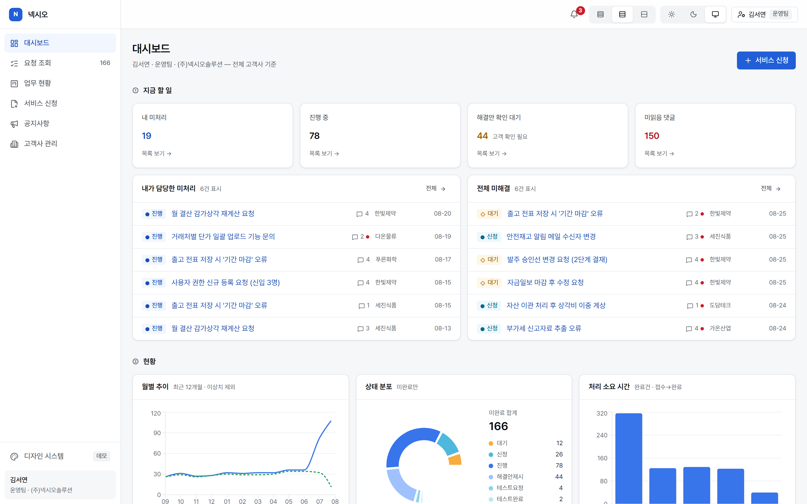
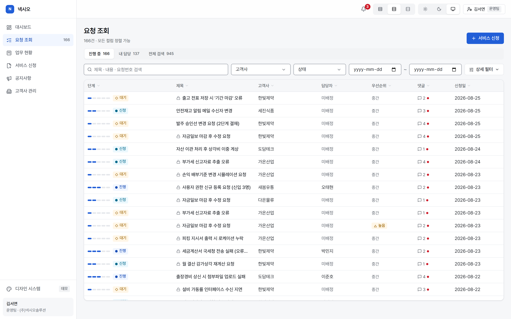
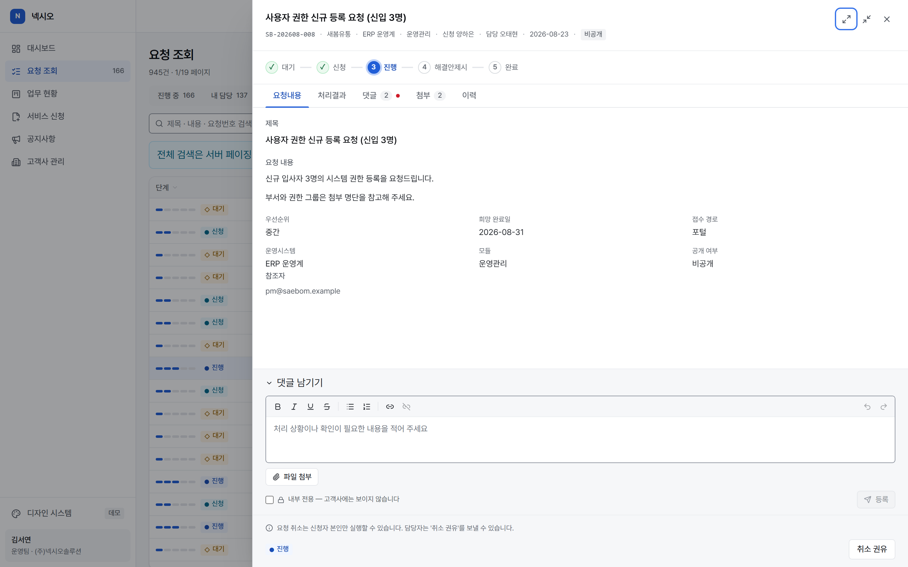
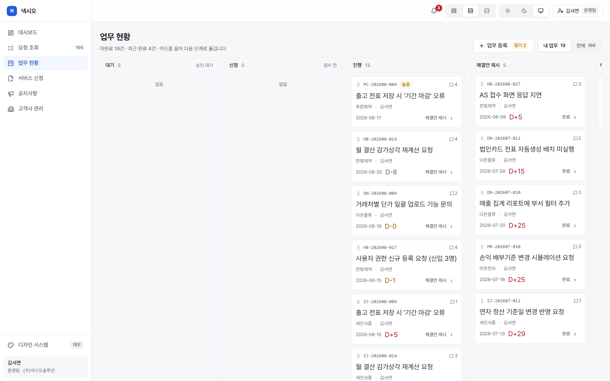
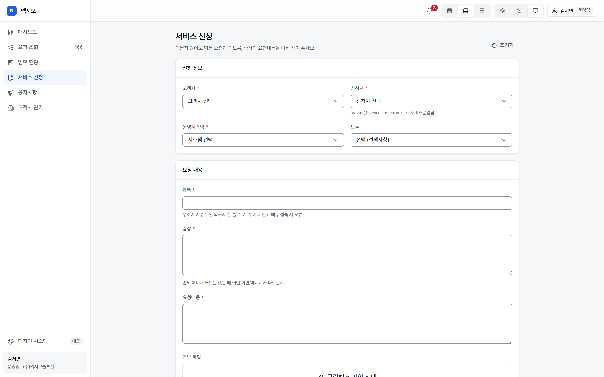
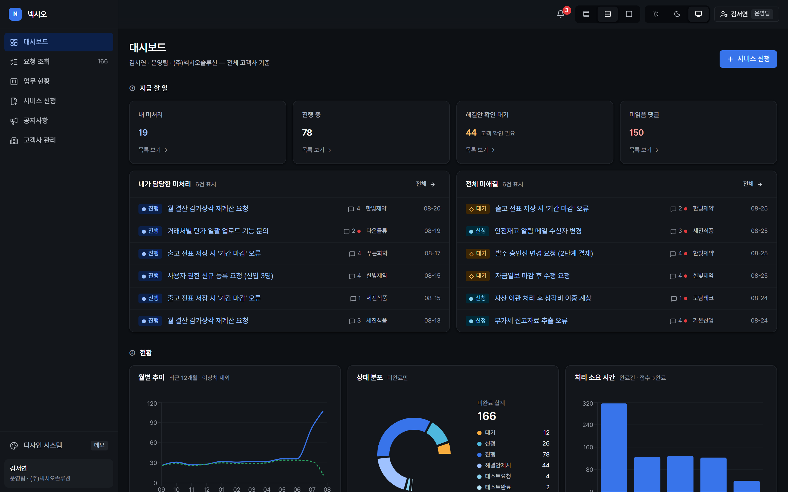

# Nexio — 유지보수 서비스데스크 포털 (Next.js 재구축)

**라이브 데모 → https://nexio-next.vercel.app**
[](https://github.com/dlzagu/nexio-next/actions/workflows/ci.yml)

> 사내에서 운영하던 **벤더포털(고객사 유지보수 요청 시스템)** 을 Next.js 로 재설계·재구축한
> 사이드 프로젝트입니다. 원본은 화면 하나가 6,611줄에 달하는 JSP 시스템이었고,
> 이 프로젝트는 실사용 데이터 분석에 근거해 그 화면을 목적별로 다시 나눈 결과물입니다.
>
> **원본 코드는 포함되어 있지 않으며, 모든 데이터는 창작입니다.** 고객사·인물·티켓 내용
> 전부 시드 생성기가 만든 가상 데이터입니다.

| | |
|---|---|
| **규모** | 화면 8개 + 알림센터 · TypeScript 12,100줄(+테스트 2,200줄) · 설계 기록(ADR) 10건 |
| **스택** | Next.js 16(App Router) · React 19 · TypeScript strict · Tailwind 4 + 자체 토큰 · Radix UI · SQLite/libSQL · Vitest · GitHub Actions · Vercel |
| **검증** | 테스트 142개 · lint → typecheck → test → build 자동 실행 |



## 화면

원본에서 **한 화면에 눌려 있던 것**을 목적별로 나눈 결과입니다. 데이터는 전부 가상입니다.

<table>
<tr>
<td width="50%"><a href="docs/screenshots/02-requests-list.png"></a></td>
<td width="50%"><a href="docs/screenshots/03-request-detail.png"></a></td>
</tr>
<tr>
<td><b>요청 조회</b> — 원본 6,611줄·버튼 25종의 화면. 필터 13개 중 상시 4개만 펴 두고, 정렬 한계·절단은 숨기지 않고 화면에 적는다</td>
<td><b>요청 상세</b> — 102필드를 5탭으로 수납. 상태·권한으로 계산된 액션만 최대 3개 노출하고, 막힌 이유는 문장으로 설명한다</td>
</tr>
<tr>
<td width="50%"><a href="docs/screenshots/04-board.png"></a></td>
<td width="50%"><a href="docs/screenshots/05-request-new.png"></a></td>
</tr>
<tr>
<td><b>업무 현황</b> — 같은 데이터의 다른 시점. 카드를 끌면 조회 화면과 <b>같은 액션 라우트</b>를 호출한다. 드래그 못 하는 환경을 위해 '다음 단계' 버튼을 함께 둔다</td>
<td><b>서비스 신청</b> — 원본의 순차 alert 8단계를 인라인 검증으로. 첨부는 고르는 즉시 형식·용량을 판정한다</td>
</tr>
<tr>
<td colspan="2"><a href="docs/screenshots/06-dashboard-dark.png"></a></td>
</tr>
<tr>
<td colspan="2"><b>다크 모드 · 밀도 전환</b> — 토큰 168개로 직접 만든 디자인 시스템(<code>/styleguide</code>). 색만으로 상태를 구분하지 않는다 — 상태군마다 글리프가 다르다</td>
</tr>
</table>

## 핵심 구현

### 1. 레거시 재설계 — 무엇을 **안 만들 것인가**부터 정했다

원본은 한 화면에 입력 102개·버튼 25종·상태 12개가 들어 있었습니다. 실사용 데이터를 분석해
보니 실제로 도는 것은 **5단계 워크플로**였고, 도입 이래 0건인 상태 3종은 컬럼조차 만들지
않았습니다. 그 근거는 `docs/inventory/data-profile.md` 에 있고, 무엇을 이식하고 무엇을 버렸는지는
`docs/decisions/ADR-0007` 에 기각 사유까지 남겼습니다.

시드 생성기(`src/lib/dev-seed/`)는 그 실측 분포(이관분 과반·비공개 다수·미사용 상태코드)를
재현하는 **결정적 생성기**입니다 — 화면이 현실적인 밀도에서 어떻게 보이는지 확인하기 위해서입니다.

### 2. 디자인 시스템을 직접 만들었다

컴포넌트 라이브러리를 가져다 쓰지 않고 **토큰 168개 · UI 프리미티브 11종 · 컴포넌트 클래스
53개**로 구성했습니다. 다크/라이트/시스템 테마와 밀도 전환을 지원하고, 살아 있는 스타일가이드
페이지(`/styleguide`)에서 토큰과 컴포넌트를 한눈에 봅니다.

접근성 규칙을 시스템 차원에서 강제합니다 — 상태를 **색만으로 구분하지 않고**(상태군마다 글리프가
다르다), 드래그가 필요한 곳에는 키보드 대안을 함께 둡니다.

> 토큰 정본은 `docs/design/tokens.css` 이고 앱은 복사본을 씁니다 — 손으로 고치지 않습니다.

### 3. 권한은 단일 게이트, fail-closed

모든 액션이 `canDo()` 한 곳을 지나고, **규칙에 없는 조합은 전부 거부**됩니다. 화면의 판정은
표시일 뿐이라 서버가 티켓을 다시 읽어 재판정합니다. 회사 정책("취소는 신청자 본인만")도
이 한 곳에서 강제됩니다. 가시성 제한(테넌트 격리·비공개 티켓)도 같은 원칙입니다.

`src/lib/permissions.ts` · `docs/design/permissions-spec.md`

### 4. 쓰기는 좁은 관문 하나로

조회와 쓰기의 관문을 분리했습니다. `select()` 는 SELECT/WITH 만, `write()` 는 INSERT/UPDATE
만 통과시키고 **넘긴 구문 전체를 한 트랜잭션**으로 실행합니다. 상태 전이는 정본표 하나가 쥐고
있어 표에 없는 액션은 실행되지 않습니다.

그래서 **상태 변경·이력 로그·첨부가 함께 저장되거나 함께 실패합니다** — 이력 없는 티켓이나
첨부만 사라진 신청이 남지 않습니다. 칸반의 카드 이동도 같은 액션 라우트를 소비하므로 두 화면이
어긋날 수 없습니다.

`src/lib/data/mutations.ts` · `docs/decisions/ADR-0006` · `ADR-0008`(첨부)

### 5. 권한은 티켓 밖에서도 같은 방식으로 판정한다

고객사 관리 화면(운영팀 전용)에서 **등록과 비활성의 권한이 다릅니다** — 등록은 운영팀,
비활성은 운영팀 관리자만. 막힌 버튼은 숨기지 않고 **왜 막혔는지 문장으로** 알려줍니다.

"삭제"는 행 삭제가 아니라 비활성입니다. 티켓 수천 건이 고객사 코드를 참조하므로 지우면
과거 이력이 끊깁니다 — 이 앱에는 지우는 경로가 없습니다(쓰기 관문이 DELETE 를 거부합니다).

`docs/decisions/ADR-0010`

### 6. 레거시 데이터를 안전하게 다룬다

원본 DB 는 본문을 **이스케이프된 HTML**로 저장합니다. 디코드 → 새니타이즈 **순서**를 지켜야
하고(뒤집으면 필터를 통과한 마크업이 살아납니다), 저장 시점에도 새니타이즈합니다.
원본 컬럼명은 `src/lib/data/` 경계 밖으로 나가지 않습니다 — 화면은 정규화된 타입만 봅니다.

`src/lib/sanitize.ts` · `docs/design/types-spec.md`

## 실행

```bash
npm install
npm run dev        # http://localhost:3000
```

그게 전부입니다. 외부 DB·환경변수·계정이 필요 없습니다 — 첫 실행 때 SQLite 데모 DB
(`.data/nexio.db`)가 자동 생성되고 가상 티켓 약 2,200건이 시드됩니다. 저장(신청·상태 변경·
댓글·첨부)도 로컬에서는 바로 동작합니다.

상단 바의 **역할 전환**으로 운영팀·고객사(승인권자/일반)·외부업체 페르소나를 오가며
권한별 UX 차이를 직접 볼 수 있습니다.

```bash
npm run verify     # lint → typecheck → test (완료 판정 기준)
npm run db:reset   # 데모 DB 삭제 — 다음 실행 때 재시드
```

## 아키텍처

```
브라우저 (Next.js App Router · React 19)
    │  Server Component 가 데이터 계층을 직접 호출
    ▼
src/lib/data/*        ← 원본 컬럼명이 갇히는 경계 (정규화는 여기서만)
    │  select() = 조회 전용 관문 · write() = 쓰기 전용 관문(한 트랜잭션)
    ▼
SQLite 호환 저장소
    · 로컬        : .data/nexio.db (파일) — 없으면 자동 시드
    · 라이브 데모  : 공유 DB(libSQL) — 인스턴스가 여럿이어도 같은 데이터를 본다
```

서버리스는 요청마다 다른 인스턴스가 응답할 수 있어, 인스턴스 메모리에 DB 를 두면 **저장한 건이
다음 조회에서 사라집니다.** 쿼리를 바꾸지 않고 저장소 계층만 SQLite 호환 공유 DB 로 교체해
해결했습니다 (`docs/decisions/ADR-0009`).

원본 시스템은 Spring MVC + MSSQL 이었습니다. 재구축 당시의 분석 문서(API 맵·VO 스키마·
데이터 프로파일)와 설계 결정 기록(ADR 10건)은 `docs/` 에 있습니다.

## 검증 · 배포

- **CI** (GitHub Actions): push/PR 마다 `verify`(lint·typecheck·테스트 142개) → `format:check` → `build`
- **CD** (Vercel Git 연동): `main` push → 프로덕션 배포, PR → 프리뷰 URL 자동 발급
- 테스트는 개수보다 **무엇을 고정하는가**가 기준입니다 — 권한 fail-closed, 데이터 위생(디코드·
  새니타이즈 순서), 쓰기 트랜잭션 원자성, 시드 불변식
- 배포 상태는 `/api/diag` 로 확인합니다 (DB 모드·쓰기 가능 여부·각 조회의 소요 시간)
- **코드와 데모 데이터의 배포 경로가 다릅니다** — 코드는 push 로 배포되지만 공유 DB 는
  따라오지 않습니다. 어긋나면 진단이 500 으로 신고하고, `db:sync:remote` 가 마스터만
  얹어 맞춥니다(라이브에서 만들어진 티켓·댓글·첨부는 그대로 둡니다)

서버리스 배포에서 실제로 밟은 함정과 대응은 `docs/decisions/ADR-0005`, `ADR-0009` 에 정리해
두었습니다.
